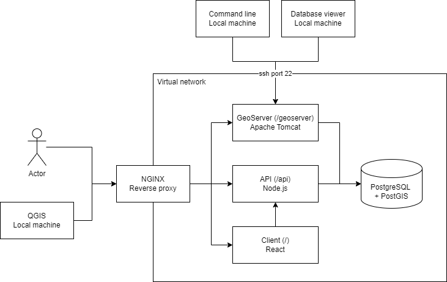

# Geothermal Atlas for Africa

This repository contains the code for the web components of the Geothermal Atlas for Africa. It does not include GeoServer, as this component is directly downloaded from the internet as a `.war` file.

The architecture of the website is as follows:

