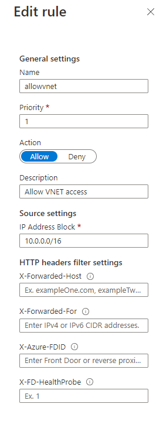

# API

APIs can be used as interfaces between the client and a database. The API holds the credentials to the database, so the
user does not need them directly. Additionally, an API restricts traffic by only allowing certain predefined requests to
the databse. Suppose the API has 2 endpoints:

- `GetAllUsers`
- `GetLayerById`

The databse behind this API could contain much more data than just users and layers, but the API only exposes two types.
The API should use parameterized queries to avoid SQL injection attacks on endpoints that allow query parameters.

Any language/framework (Node.js, .NET, Flask, …) can be used to build the API. In my case, I chose to use Node.js with
Express (<https://expressjs.com/en/starter/hello-world.html>), because setup is relatively straightforward.

In the case of a GIS web application, the API contains could contain endpoints to gather data about object that the user
clicked on the map.

## Restricting access to the API in Azure

The API should not be directly accessible from outside the network. Instead, the API should be exposed by the proxy.
Restricting inbound traffic can be configured in Azure Portal.
App Service page > Networking > Access restrictions  > Add Rule
Set the source IP range to the IP range of the VNET.
Navigating to the url (for example gaa-api.azurewebsites.net) will now show a 403-Forbidden.
The proxy, however does have access because it lives inside the VNET, albeit with an opening on port 80 and 443.
Check if the proxy has acces by navigating to the api url (for example gaa-proxy.azurewebsites.net/api)

|  |
|:------------------------------------------------------------------:|
|               *Allowing VNET access to App Service*                |
