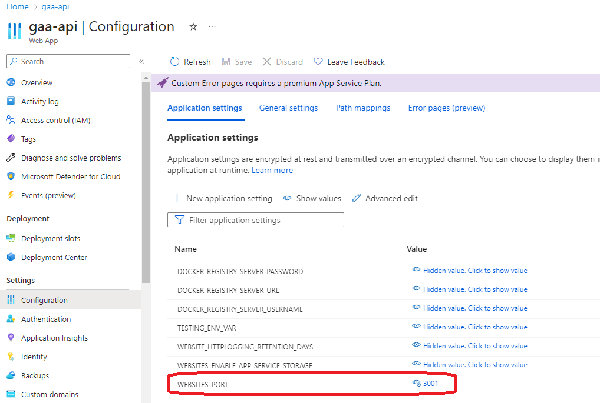
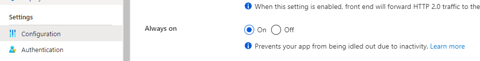

# Azure

The components described in the Architecture section need to be hosted on a hosting platform. There are many ways to
host such a system. You could build the complete infrastructure as virtual vachines, but that results in a lot of
maintenance. Cloud Platforms such as Microsoft Azure, Amazon AWS or Google Cloud provide a lot of out-of-the-box
components, which makes life of the developer easy. Creating a virtual machine on such a cloud platform takes less than
5 minutes to create. Azure is chosen as the cloud platform because I have had some minor prior experience with it.

|  |
|:-------------------------------:|
|          *Azure logo*           |

## Services used

For our use case, we will use the following Azure services/resources:

- Virtual machine: Hosting GeoServer
- App service: Client, API, Proxy
- PostgreSQL: Spatial database
- VNET: Virtual network

## Cost

To keep track of monetary resource use, Azure provides a cost management dashboard called Cost Management. As a frame of
reference, these are the costs per month associated to the services at the time of writing:

- GeoServer VM: €32.99
- App Service Plan: €10.95 for a test plan
- PostgreSQL Database: €15.96

## General notes on hosting (containerized) App Services

App Services are Azures way to host web applications. They are easy to set up and maintain.
The App Service can be configured to run a Docker container. This is the way the Client, API and Proxy are hosted.
A few things to keep in mind when hosting a Docker container on an App Service to improve performance:

### Setting the website port for fast reloading

If the Docker container exposes a different port than 80, make sure to set the WEBSITE_PORT environment variable in
Azure Portal.
Setting this environment variable ensures the container startup is almost instantaneous after a restart instead of
having to wait for multiple minutes while the startup is searching for activity on the default port (80) .

|  |
|:------------------------------------------------------------------------------:|
|       *Set website port for instantaneous app service container startup*       |

### Setting Always on mode to reduce startup time after inactivity

By default, if an App Service is not used for a while, the container will be stopped.
This means that the next time the App service is used, the container will have to be started again, which can take a
while.
To avoid this, the Always on setting can be enabled in Azure Portal.
This will keep the container running, even if there is no activity.

Navigate to the App Service's Configuration page > General Settings > Always on > On

|            |
|:------------------------------------------------:|
| *Enable Always on to keep the container running* |