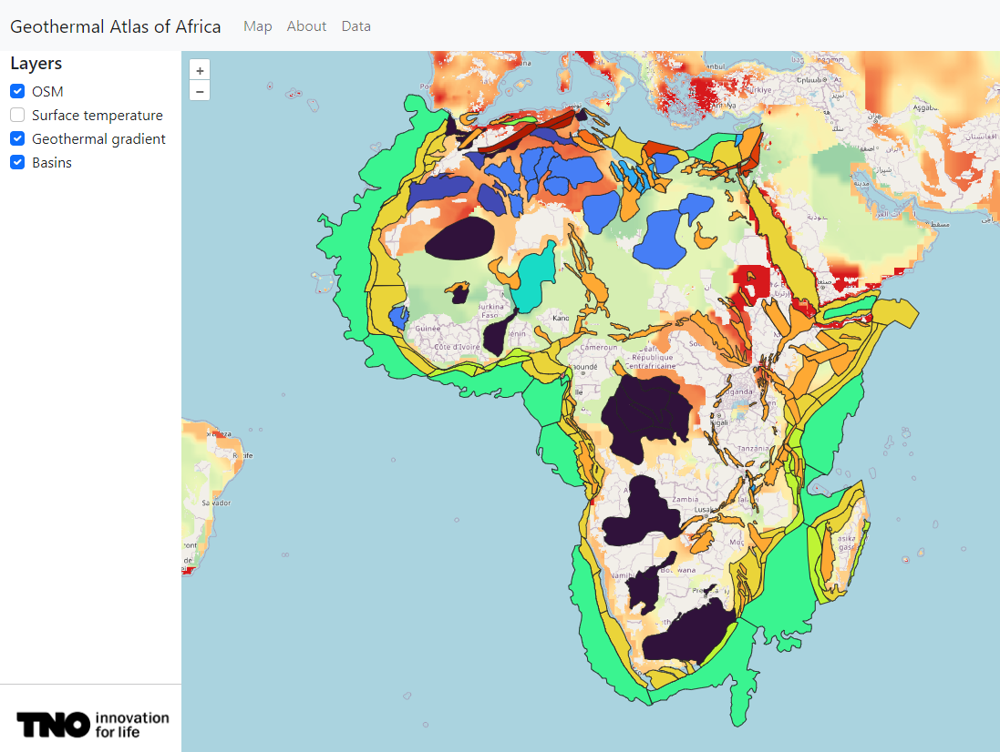

# Client

The website uses the OpenLayers package to visualize the layers server by GeoServer.
OpenLayers (<https://openlayers.org/>) supports a wide variety of layer types. In our case, we are interested in
connecting to a Web Map Service (WMS) and a Web Feature Service (WFS).

The OpenLayers documentation is quite extensive and is a good resource for debugging or searching for extra features.

|       |
|:-----------------------------------------------------:|
| *Example of a React + Bootstrap + OpenLayers website* |

## Connecting to GeoServer WMS

The following figure shows some JavaScript code of a TileWMS layer source calling a GeoServer instance hosted on Azure.
If GeoServer is running locally, this should be replaced by localhost.

```typescript
const source = new TileWMS({
    url: 'https://gaa-proxy.azurewebsites.net/geoserver/wms',
    params: {
        'layers': 'project:test',
        'TILED': true,
    },
    serverType: 'geoserver',
    hidpi: false // very important for proper GeoWebCache calls
});
```

The `layers` parameter defines the name of the layer that should be shown.

The `TILED` parameter is very important for correctly using GWC as described earlier. Without the TILED parameter, GWC
will not be used and therefore will hinder performance.

The other important parameter is `hidpi`. If enabled, this adds a dpi (Dots Per Inch) parameter to the URL. This
parameter will cause GWC to not work for small or large screens because GeoServer constantly has to recalculate tiles
for the supplied dpi value. So, turn it off.

## Connecting to a GeoServer WFS

Connecting to a WFS is slightly different and requires some extra parameters. Once again, we connect through an Azure
App Service URL ending in .azurewebsites.net. The format we want to consume is GeoJSON. Contrary to a WMS which serves
images in png/jpeg, the GeoJSON that is sent from a WMS service contains the features in object notation. This allows
for highlighting and selecting individual features in the map. This is a nice feature for interacting with shapefiles.

```typescript
const source = new VectorSource({
    format: new GeoJSON(),
    url: (extent) => {
        return (
            'https://gaa-proxy.azurewebsites.net/geoserver' + 'wfs?service=WFS&' +
            'version=1.1.0&request=GetFeature&typename=project:basins&' +
            'outputFormat=application/json&srsname=EPSG:3857&' +
            'bbox=' +
            extent.join(',') +
            ',EPSG:3857'
        );
    },
    strategy: bboxStrategy,
});
```

## Customizing Bootstrap

Bootstrap uses SCSS for customization. The SCSS files are located in the `src/scss` folder. `scss` files can not
be used directly and need to be compiled to regurlar `css` first. To set up scss compiling on your machine, follow these
steps:

1. Create a file called `src/scss/custom.scss`. Example of the content:

    ```scss
   $carousel-caption-width: 100%;
   $carousel-caption-spacer: 0px;

   @import "../../node_modules/bootstrap/scss/bootstrap";
   ```

2. Install the [sass](https://www.npmjs.com/package/sass) compiler globally using the
   command `npm install -g sass`.
3. Configure automatic compilation of `scss` files to `css` in
   PyCharm: https://www.jetbrains.com/help/pycharm/transpiling-sass-less-and-scss-to-css.html
4. Import the compiled `custom.css` file in a `tsx` file such as `App.tsx`. Example of the import in `App.tsx`:

   ```typescript jsx
   import './App.css';
   import './scss/custom.css'
   import React, {useEffect, useState} from "react";
   
   function App() {
      ...
   }
   ```
5. Make sure the import of `custom.css` occurs later in the import chain than the import of Bootstrap css. Otherwise,
   the customizations will not be applied. Correct order:
    1. First, `index.tsx` imports Bootstrap's `css` and `js` files
    2. Then, `index.tsx` imports `App.tsx`
    3. Finally, `App.tsx` imports `custom.css`, ensuring custom css is loaded on top of default css instead of the other
       way round.

## PyCharm configuration

### Marking resource root

Pycharm is not able to resolve content in the `client/public` directory. It will produce warnings, but the website will 
work fine. In PyCharm, right click on the `client/public` directory and select `Mark Directory as` -> `Resource Root`. 
This will remove the warnings and allow PyCharm to supply auto-completion to files in the `public` directory.