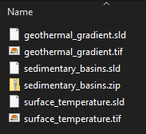

# Data to GeoServer

All the vector and raster data should be gathered in a QGIS project.
Afterwards, the data from the QGIS project can be uploaded to GeoServer using a script.

## Data preparation in QGIS

As a first step, the styled raster and vector layers should be prepared in a QGIS project.

### Rasters

All the raster layers should be saved as `.tif` format.

### Vectors

All the vector layers should be saved shapefiles (`.shp`).

## Styling

The styling should be configured in QGIS for both the raster and vector layers.
After the desired style is achieved, the styles should be exported to `.sld` format.
This is the format GeoServer is able to parse.

To export the style files, run the `export_style_files_in_qgis.py` script in QGIS. A step by step guide:

1. In the QGIS project, go to `Plugins > Python console`
2. Paste the code into the console window that appears
3. In the script, change `style_path` to the directory that the styles need to be exported to
4. Then in the QGIS Layers panel, select all the layers that need to be exported.
5. Then, enable or disable them with space bar.
6. Finally, press the green run button in the Python console and the style files should appear in the export directory.

## Create the data directory

Finally, combine the data and raster files into a single directory. Some rules:

- Each layer (either raster or vector) should be represented by two files in the directory.
- As shapefiles often consist of multiple files, they should be zipped into a `.zip` file.
- The filename of each file should match the filename in the layer configuration file (excel or yml)
- Raster files should be saved as `.tif`
- Style files should have the same name as the data file but with a `.sld` extension

Example:

## Data configuration files

...

## Data to GeoServer

...
