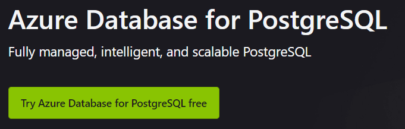
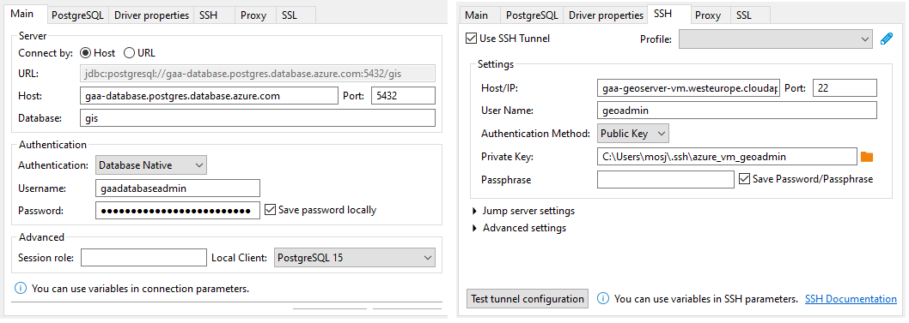

# Database

Databases are used to store data and allow easy access to them. By default, GeoServer uses its data directory to store
the raster and shapefiles. Shapefiles, however, can also be stored in a database, thereby decoupling data storage and
possibly increasing performance and/or reliability. GeoServer supports PostgreSQL with PostGIS out of the box and is
therefore chosen as the database of choice.

## Creating a PostgreSQL database on your local machine

To install a PostgreSQL database with the PostGIS plugin on your local machine, follow these steps:

- First, download and install PostgreSQL from <https://www.postgresql.org/>. Make sure to also include the StackBuilder
  program in the installation.
- Run StackBuilder and select PostGIS under the Spatial Extensions section. Install.
- Next, start PgAdmin,log in and create a database called `gis` (or any other name that is convenient for your usecase).
- Next, we need to enable PostGIS. PostGIS is an optional extension that must be enabled in each database you want to
  use it in before you can use it. Installing the software is just the first step. DO NOT install it in the database
  called postgres.
- Connect to your database with psql or PgAdmin.

## Creating a PostgreSQL database in Azure

Azure provides fully managed PostgreSQL datatabase instances as a part of their offer. The PostGIS extension is
supported: <https://learn.microsoft.com/en-us/azure/postgresql/single-server/concepts-extensions>.

|                                                   |
|:-----------------------------------------------------------------------------------------------------------:|
| *Screenshot of Azure's PostgreSQL page (<https://azure.microsoft.com/en-us/products/postgresql/#overview>)* |

During the creation of the database in Azure Portal, you should specify that the database should not have a public IP
address. Make sure to integrate the database into the Azure Virtual Network to be able to access the API only from
services withing Azure and not from the outside world.

### Connection to the Azure database

Because the database is private, we can not connect directly to it from our local machine. We need to set up an SSH
tunnel.

The VM on which geoserver is installed allows SSH access on port 22. So, this machine can be used as a tunnel to our
database. One option is to first SSH into the machine and connect to the database from there from the command line. An
easier and more convenient method is to use software like Dbeaver to configure the SSH tunnel and make it look like
you're using the database directly.

Dbeaver is a database viewing software. Create a new connection in Dbeaver and use the following setup (adjust to your
needs):

|  |
|:-------------------------------------------------------------:|
|    *DBeaver database connection settings using SSH tunnel*    |

You may or may not need to enable SSL by checking the checkbox in the SSL tab of the Dbeaver connection settings. With
this configuration, you should be able to view the database and perform queries on your local machine.

## Initializing the database

Connect to the database either directly or through the tunnel as described above (depending on whether the database is
running locally or in the cloud).

If you haven't already, create a database called `gis`:

```sql
CREATE DATABASE gis;
```

Next, run the following query to install the PostGIS extension into the `gis` database.

Run the following SQL:

```sql
CREATE EXTENSION postgis;
```

PostGIS is now properly configured to be used by GeoServer.

Example for creating a non-spatial table in the `gis` database:

```sql
CREATE TABLE IF NOT EXISTS gis.public.testtable
(
    id   SERIAL PRIMARY KEY,
    name VARCHAR(50) NOT NULL
);
```
