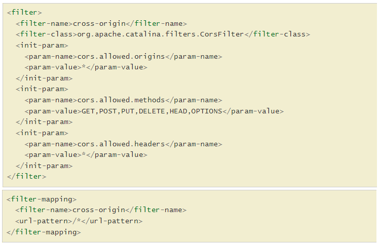

# GeoServer

To avoid high licensing costs, GeoServer (<https://geoserver.org/>) can be used as an open source and free alternative
to ArcGIS products for hosting maps online. It works out of the box without any pre-configuration, but requires some
tweaking to suit the needs for our goal. It supports many of the common geospatial data formats such as shapefiles and
rasters.

GeoServer is hosted using an Azure Virtual Machine (VM). Another option would be to host the instance in Azure App
Service directly or as a container. In my testing, however, performance of GeoServer in an App Service is not good. I
have not found a direct reason for this, but I suspect it has got something to do with security. For smaller apps, like
a simple API, using App Service is preferred.

|  |
|:---------------------------------------:|
|            *GeoServer logo*             |

## Create the VM

The first step is to create the VM. The Microsoft website contains the required documentation to set up the
VM: <https://learn.microsoft.com/en-us/azure/virtual-machines/linux/quick-create-portal?tabs=ubuntu>.

The cost of the virtual machine depends on how powerful of a configuration you choose. I would recommend to start
small (2 CPUs and 4GB RAM) and increase the computational power when neccessary.

## Ports

To allow and restrict access to the virtual machine, we need to open some ports.

GeoServer will run on port 8080, so we need to open this port. In Azure Portal, navigate to the VM and go to the
Networking blade. Click the `Add inbound port rule` button and enter the following properties:

- Priority: 1000
- Name: AllowAnyCustom8080Inbound
- Port: 8080
- Protocol: Any
- Source CIDR range: 10.0.0.0/16 (this is the IP range of the Azure virtual network)
- Destination: Any

Make sure to also create a rule for HTTPS access over port 8443 instead of 8080 and set its priority to 1001.

It is also good practice to prevent any IP address from attempting to SSH into your virtual machine. If you don't, you
will get many hacking attempt warning emails from Azure. There are bots running constantly checking all IP addresses for
potential SSH access. Once again, click the button to add a rule. Set the following properties on the rule:

- Source IP addresses: `134.203.0.0/16,134.221.0.0/16,139.63.0.0/16`. This is the range of public IP addresses of TNO.
- Service: SSH
- Protocol: TCP
- Action: Allow
- Priority: 1011
- Name: AllowCidrBlockSSHInbound. Will probably be set automatically.

## Further SSH access restrictrions

To increase SSH security restricturions even more, you can disable password authentication and require a public/private
key login. Follow this tutorial to set it
up: <https://www.cyberciti.biz/faq/how-to-disable-ssh-password-login-on-linux/>.

General steps:

1) Create a new sudo user
2) Create SSH keypair on local machine ssh-keygen
3) Install the public key on the remote machine using ssh-copy-id
4) Disable password authentication in /etc/ssh/sshd_config
5) Restart the ssh service

Be sure to save your username password combination somewhere safe. Let's say your username is `geoadmin` and the name of
the VM is `gaa-geoserver-vm`, then the SSH login command would be:

```console
ssh -i <PRIVATE_KEY_PATH> geoadmin@gaa-geoserver-vm.westeurope.cloudapp.azure.com
```

## Virtual Network integration

The geoserver instance should not be accessible through its ip address directly. It should be behind a reverse proxy. In
Azure, both the reverse proxy and the GeoServer instance should be connected to a Virtual Network (VNET).
In the GeoServer VM configuration, change the Inbound rules to only allow traffic from inside the virtual network by
setting the source ip address range to the private ip range of the VNET. The IP range of the VNET is visible in Azure
Portal in the overview page of the VNET resource.

|  |
|:------------------------------------------------------------------------:|
|                *IP Address range of the Virtual Network*                 |

Next, navigate to the VM configuration in Azure Portal and go to Networking. Update the AllowAnyCustom8080Inbound and
AllowAnyCustom8443Inbound rules to only allow the Source IP Addresses of the VNET.

|          |
|:---------------------------------------------------------:|
| *Setting the proxy base URL in GeoServer global settings* |

## OpenJDK

The HTTP web server (Tomcat) will run on Java. We will use Java OpenJDK version 8. Follow the installation instructions
on the OpenJDK website to install OpenJDK on the VM you created <https://openjdk.org/install/>.

```console
sudo apt-get install openjdk-8-jresudo apt-get install openjdk-8-jre
```

## Tomcat

The GeoServer service must be hosted in a HTTP web server. We choose Tomcat as its officially supported by GeoServer.
Follow the instructions on the following website to install Tomcat under a non-root
user: <https://tecadmin.net/install-tomcat-8-on-centos-8/>.

In step 4 of that website (Enable Host/Manager for Remote IP), add the private IP as well as the public IP of your VM (
found in Azure Portal at the Overview blade of your VM), to be sure the connection is allowed.

In step 6 (Create Tomcat Start Script), replace `Environment="JAVA_HOME=/usr/lib/jvm/jre"` by the location of the
OpenJDK. In my case, the location is `JAVA_HOME=/usr/`, but be sure to validate the path.

GeoServer will be deployed as a .WAR (Web Archive) file that is larger than the default allowed file size of Tomcat (
50MB). The file size can be changed by changing the `<max-file-size>` and `<max-request-size>` properties
in `<TOMCAT_INSTALL_LOCATION>\webapps\manager\WEB-INF\web.xml`. Set the size to at least 200MB.

If you are not able to change the files due to rights issues, remeber that editing the tomcat configuration/files can
only be done by the tomcat user because it owns the folder. Switch to the tomcat user and try again:

```console
sudo -su tomcat
```

To be able to access the manager/host-manager pages of tomcat, the `<Valve>` section
in `<TOMCAT_INSTALL_LOCATION>/webapps/manager/META-INF/context.xml` must be commented
out: <https://stackoverflow.com/questions/36703856/access-tomcat-manager-app-from-different-host>

Make sure to restart the tomcat service:

```console
sudo systemctl stop tomcat.service
```

```console
sudo systemctl start tomcat.service
```

Verfiy that Tomcat is running as it should be navigating to `<VM_PUBLIC_IP>:8080`. You should see a Tomcat page.

Next download the WAR file from GeoServer's website <https://geoserver.org/download/>. Navigate to `<VM_PUBLIC_IP>:8080`
and upload the WAR file. If the deployment was succesfull, browse to geoserver `<VM_PUBLIC_IP>:8080/geoserver`. You
should see the GeoServer admin interface. The default credentials are as follows:

- Username: `admin`
- Password: `geoserver`

|  |
|:------------------------------------------------------------:|
|                 *GeoServer admin interface*                  |

After the deployment was succusful, disable the Tomcat manager and host-manager pages by commenting out the users and
roles in `tomcat/config/tomcat-users.xml`. Leaving them exposed is a security risk.

## HTTPS

In case you want to access your site through HTTPS, you need to add a TLS certificate. If the VM will be exposed through
a reverse proxy such as NGINX, HTTPS is not neccessary.

Some links that might be useful:

- Article explaining SSL and configuring Tomcat for HTTPS: <https://www.mulesoft.com/tcat/tomcat-ssl>
- Install (self signed) certificate on tomcat: <https://tomcat.apache.org/tomcat-8.5-doc/ssl-howto.html>. Be sure to
  comment out the `<SSLHostConfig>` section of the `<Connector>` node in the conf/server.xml port 8443 section. Be sure
  to open port 8443 on azure vm as well.

## GeoServer Configuration

### Data directory

The GeoServer data directory is the location in the file system where GeoServer stores its configuration information.
The configuration defines what data is served by GeoServer, where it is stored, and how services interact with and serve
the data. The data directory also contains a number of support files used by GeoServer for various purposes. For
production use, it is recommended to define an external data directory (outside the application) to make it easier to
upgrade.

See <https://docs.geoserver.org/latest/en/user/datadirectory/index.html#datadir> for additional information.

### Change default password

One of the first things you should change is the default password of the admin
interface. <https://gis.stackexchange.com/questions/122621/changing-geoserver-admin-password>.

The password can be set in the administration interface or can be preset in the WAR file. The latter option is preferred
because then GeoServer will not "forget" its password configuration on each redeploy.

Users and their passwords can be managed set in `<GEOSERVER_DATA_DIRECTORY>/data/security/usergroup/default/users.xml`.
According to the GeoServer documentation, setting the password in this file as plain text is not recommended as anyone
with access to the file system can see the password. For more information on changing passwords, check the
documentation <https://docs.geoserver.org/stable/en/user/security/passwd.html>.

### Enable CORS

Enable Cross-Origin Resource Sharing (CORS) to allow JavaScript applications outside of your own domain, or web
browsers, to use GeoServer. For more information on what this does and other options see the Tomcat
documentation (<https://tomcat.apache.org/tomcat-9.0-doc/config/filter.html#CORS_Filter>).

Enable CORS in the GeoServer WAR file under WEB-INF/web.xml. There are two sections which need to be uncommented. First,
if using Tomcat as a server, the `<filter>` section on `apache.catalina.corsfilter` and the second (regardless of server
choice) the `<filter-mapping>` section. For more information, check the documentation
website <https://docs.geoserver.org/latest/en/user/production/container.html>.

Redeploy the WAR file through the Tomcat interface.

|  |
|:---------------------------------------------------------------------------:|
|     *Uncomment these sections in the web.xml file for a Tomcat install*     |

### Installing plugins

Plugins can be used to extend the default functionality of GeoServer. I will give an example for the Vector Tiles
plugin, but the process is the same for all plugins.

Not only rasters, but also vector layers can be cached. For this to work, a plugin needs to be installed. This can be
done by downloading the plugin from the GeoServer website and subsequently editing the WAR file to include the plugin.

Download the “Vector Tiles” plugin from <https://geoserver.org/release/stable/>. Make sure the version matches your
GeoServer version.

Next, unzip the geoserver.war file with archiving software such as 7zip. Place the contents of the plugin zip (should be
one or more .jar files) in the WEB-INF/lib/ folder.

Redeploy the WAR through the Tomcat administration interface. Once GeoServer has started, navigate to the web
administration interface. Go to Tile Caching > Caching Defaults. Under the Default Tile Image Formats you should now see
the type geosjon supported for caching. Enable the checkbox and save.

### Tile caching

Tile caching is the process of saving prerendered WMS tiles to the disk to avoid on the fly rendering, hereby
drastically improving performance of raster layers.

Caching can be enabled at the admin interface at Caching Defaults > Enable direct integration with GeoServer WMS.

Additionally, set a disk quota to avoid excessive disk usage under Disk Quota > Enable Disk quota and choose an
appropriate size.
Tiles can be seeded (cached in advance) to increase performance by going to GEOSERVERURL/geoserver/gwc and selecting the
layer that needs to be seeded. Alternatively, a REST call can be
performed (<https://docs.geoserver.org/stable/en/user/geowebcache/rest/seed.html>).

## GeoServer behind a proxy

### Proxy base URL

If the geoserver instance is behind a reverse proxy such as NGINX, make sure to set the Proxy base url in the global
settings of GeoServer. For example, an NGINX container named gaa-proxy is deployed in Azure that serves geoserver under
proxy/geoserver, where proxy is the DNS name of the proxy (<https://gaa-proxy.azurewebsites.net>). Then the proxy base
url is <https://gaa-proxy.azurewebsites.net/geoserver>.
If the proxy url is not set, the web interface (logging in, previewing layers etc) might not work (due to forwarding
issues?).

|  |
|:----------------------------------------------------------------:|
|    *Setting the proxy base URL in GeoServer global settings*     |

### Cross-Site Request Forgery whitelist

Additionally, The GeoServer web admin employs a CSRF (Cross-Site Request Forgery) protection filter that will block any
form submissions that didn’t appear to originate from GeoServer. This can sometimes cause problems for certain proxy
configurations. Therefore, please add the proxy domain to GeoServer's `web.xml` whitelist.
See: <https://docs.geoserver.org/stable/en/user/security/webadmin/csrf.html>.
