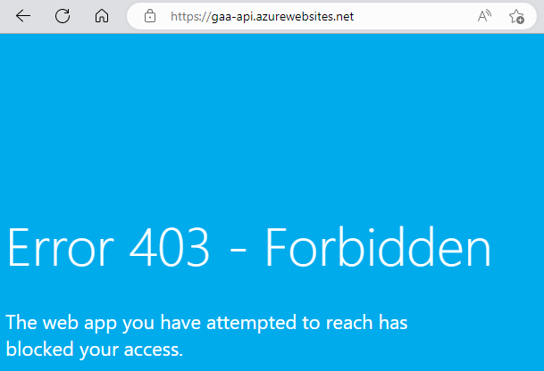
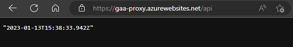
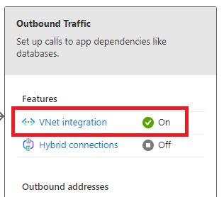

# Reverse proxy

Reverse proxies are used to control network traffic to (internal) services. In the architecture described in this
document, the reverse proxy serves as the single entry point to all services. For example, the client is available
at `<PROXY_URL>/`, the API is available at `<PROXY_URL>/api` and GeoServer is available at `<PROXY_URL>/geoserver`. It
is also a cost saver when buying domain names and certificates because you only need 1 website to claim and certify.

Most importantly, however, the proxy is an important security measure. The stack consists of multiple components (
client, api, geoserver, database) that should not be exposed to the outside world. The proxy is set up in such a way
that it is the only point of access to the services. Trying to directly access a service (for example navigating
to `my-api.azurewebsites.net/getname?name=hello`>) will cause a `403 - Forbidden` page to appear.

|                               |
|:---------------------------------------------------------------------:|
| *Error page appears if direct access to the API service is attempted* |

Navigating to the the proxy with `/api` will internally route the traffic to the API and will grant the user access.

|                                                                        |
|:-----------------------------------------------------------------------------------------------------------------------:|
| *Result of access the API through the proxy. In this case, the root route of the API return the current date and time.* |

## NGINX configuration

NGINX is used as the reverse proxy of choice. Example NGINX configuration:

```nginx
worker_processes 1;

events {
    worker_connections 1024;
}

http {
    server {
        # Listen on either IPV4 or IPV6
        listen 80;
        listen [::]:80;
        server_name _;

        # GeoServer
        location /geoserver {
            proxy_pass http://10.0.2.4:8080/geoserver;
            proxy_set_header Host $proxy_host;
            proxy_set_header X-Real-IP $remote_addr;
            proxy_set_header X-Forwarded-For $proxy_add_x_forwarded_for;

            client_max_body_size 200M;
        }

        # API
        # In this case, only traffic inbound traffic from the VNET is allowed to gaa-api.azurewebsites.net.
        # That traffic control is configured in Azure Portal
        location /api {
            proxy_pass https://gaa-api.azurewebsites.net/;
        }

        # Client
        location / {
            proxy_pass https://gaa-client.azurewebsites.net/;
        }
    }
}
```

## NGINX container deployment

NGINX is deployed in Azure using a Doceker container. Example Dockerfile using a production version of the configuration
file:

```dockerfile
FROM nginx:1.23.3-alpine
 
COPY nginx.prod.conf /etc/nginx/nginx.conf
```

## Azure Virtual Network integration

The reverse proxy Azure App Service should be integrated into the virtual network. This can be achieved by navigating to
the Networking page of the App Service, and selecting VNET integration under Outbound Traffic.

|     |
|:---------------------------------------------------------------------:|
| *VNET integration option in Networking blade of an Azure App Service* |

Connect to an available VNET subnet by filling in the form.

## GeoServer configuration changes

GeoServer requires some additional configuration to work within a proxy. Please see the GeoServer section of the
documentation.
