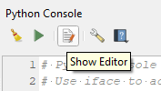
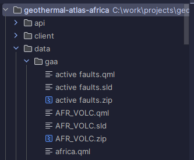
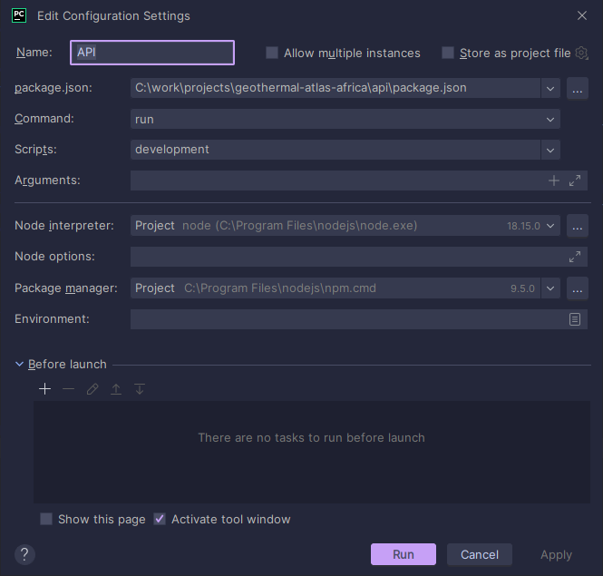
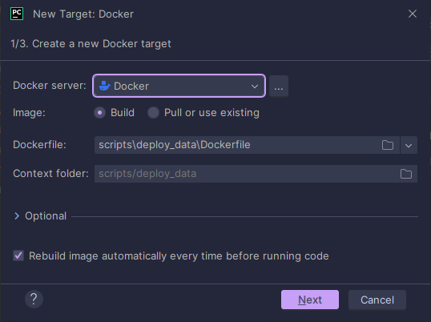
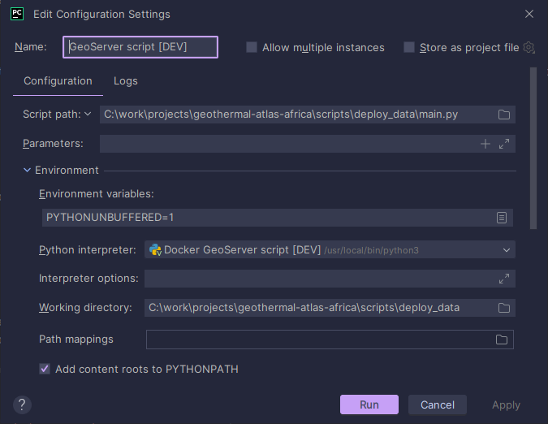
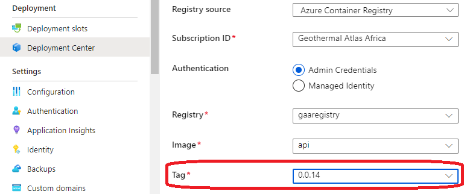

# Scripts

Tedious tasks are automated with scripts. The scripts are written in python and shell.

## Exporting a QGIS project to a .zip

This script exports all the layer data and layer styling to a zip file. The contents of the output zip file are
structured in a way that it can be read directly by the data upload script (see section "Uploading map layers to
GeoServer").

Keep in mind that the script saves shapefiles as `.zip` and rasters as `.tif`. This is because GeoServer natively
supports
these formats and no further packing/unpacking etc. is needed in further steps.

To run the script, follow these steps:

1. Open QGIS and go to Plugins > Python Console.
2. In the Python console window, open the editor:

   |  |
             |:-----------------------------------------------------------:|
   |               *Python editor button in QGIS.*               | 

3. Copy the contents of `export_qgis_data_to_directory/main.py` to the QGIS python editor.
4. Change the file location to your personal preference and run the script by clicking the green button.

## Uploading map layers to GeoServer

Script location: `scripts/deploy_data/main.py`

Running main.py does the following:

- Set up a connection with the API that is responsible for communication with the database.
- Runs database migrations. Database migrations are small scripts that are run to update the database schema. For more
  information: see https://www.cloudbees.com/blog/database-migration.
- Checks an Excel file for layer metadata.
- For each layer, upload the shapefile or raster file to GeoServer.
- For each layer, create an entry in the database. The database is read by the client to dynamically set up the layer
  selection widget.

The start of the script contains some file/path information that needs to be set up accordingly before running the
script.
A `workspace` in context of the script is a GeoServer workspace. The workspace is used as an identifier for the layers.
The script runs in a Docker container.

### Run instructions:

Make sure you have the following software installed:

- Docker
- PyCharm
- Node.js
- NPM
- PostgreSQL

Notice that there's two Dockerfiles in the folder: `Dockerfile` and `Dockerfile.prod`. There is a distinction between
the local environment and the production environment. The local environment Dockerfile (`Dockerfile`) uses the API on
the local machine and therefore the database on the local machine. The production environment
Dockerfile (`Dockerfile.prod`) uses the API on the production server and therefore the database on the production
server. They both use GeoServer on the production server since there is no support for a GeoServer instance on the local
machine yet.

Make sure the data is correctly set up:

- Metadata file. See `scripts/data_deploy` gaa_metadata.xlsx for an example.
- Data folder. Contents of the zip created by the export_qgis_data_to_directory script should be copied to its
  respective folder in the `data` directory of the project. Example for workspace `gaa`:

  |        |
          |:------------------------------------------------------------------:|
  | *Example of what the data directory/directories should look like.* |

1. Open PyCharm and open the project.
2. In PyCharm, create a run configuration for the API. Use the following settings:

   |  |
             |:----------------------------------------------------------:|
   |           *PyCharm Run Configuration of the API*           |

3. In PyCharm, create a Python interpreter from the Dockerfile in the data_deploy folder. Use the following settings:

   |  |
             |:-----------------------------------------------------------------------:|
   |       *Create Python interpreter from a docker image in PyCharm*        |

4. Create a development environment run configuration for the script. Make sure to set the Python interpreter to the
   Docker interpreter we just created. Use the following settings:

   |  |
             |:-----------------------------------------------------------------------------------:|
   |                *PyCharm Run Configuration of the data deploy script*                |

5. Create a production environment run configuration for the script. Use the same settings but be sure to use the
   production interpreter instead of the development interpreter.
6. Start the API run configuration in PyCharm.
7. Finally, run the data deploy script by selecting the run configuration for either dev (from step 4) or production (
   from step 5).

## Deploying components to Azure

Once you are ready to deploy a component to Azure, use the `push_images.sh` script located in
the `scripts/deploy_image_to_acr` folder. Follow these steps:

1. Follow the steps on Microsoft's documentation page to install Azure CLI and login into Azure
   CLI: https://learn.microsoft.com/en-us/cli/azure/get-started-with-azure-cli
2. Start Docker Desktop. It needs to be running for the script to work.
3. Uncomment the component you want to update (e.g. api or client) and comment all others.
4. Update the version number. For example from 0.0.11 to 0.0.12.
5. Navigate to the `deploy_image_to_acr` folder with a commandline interface (for example Git Bash).
6. Run the script:

    ```shell
    ./push_images.sh
    ```

7. Finally, go to the Azure portal and navigate to the component you just updated. In the Deployment Center of the
   component, select the new version by using the "Tag" dropdown. Save the changes. The App Service will now restart and
   the new version will be live.

   |  |
   |:---------------------------------------------------------------:|
   |        *Selecting the newest version of the App Service*        |

## Converting .env files to JSON for Azure

Not used yet. Only proof of concept.
